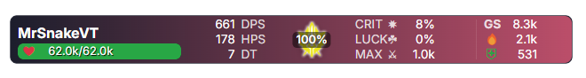

# DPS METER by MrSnake

[English Version](#dps-meter-by-mrsnake-english-version)

Este es un medidor de DPS (Daño Por Segundo) diseñado para Blue Protocol: Star Resonance, útil para streamers que desean mostrar esta información en sus transmisiones.

## ¿Cómo funciona?

Este medidor de DPS funciona capturando y analizando el tráfico de red del juego en tiempo real. Utiliza Npcap para monitorear los paquetes de datos que el juego envía y recibe, decodificándolos para extraer información sobre el daño infligido, la curación realizada y otras estadísticas de combate. Esto permite obtener una visión precisa del rendimiento sin interactuar directamente con los archivos del juego.

A continuación, se muestra una imagen del medidor con los puntos clave explicados:

Cada elemento del medidor tiene una función específica:

1.  **Nombre de jugador:** Identifica al jugador en el medidor.
2.  **Vida actual y máxima:** Muestra la salud actual y la salud máxima del jugador, con una barra de progreso visual que indica el estado de su vida.
3.  **DPS (Daño por Segundo):** Indica la cantidad de daño que el jugador está infligiendo por segundo.
4.  **HPS (Curación por Segundo):** Muestra la cantidad de curación que el jugador está realizando por segundo.
5.  **DT (Daño Recibido):** Representa el daño total que el jugador ha recibido durante el combate.
6.  **Contribución %:** Porcentaje del daño total del grupo que ha sido infligido por este jugador, mostrando su impacto en el combate.
7.  **CRIT ✸ (Crítico):** Porcentaje de golpes críticos realizados por el jugador.
8.  **LUCK ☘ (Suerte):** Porcentaje de golpes de suerte realizados por el jugador.
9.  **MAX ⚔ (Máximo DPS):** El pico más alto de daño por segundo que el jugador ha alcanzado en un momento dado.
10. **GS (Puntuación de Equipo):** Puntuación de equipo/habilidad del jugador, que indica la calidad y el nivel de su equipamiento y el poder de sus habilidades.
11. **🔥 (Daño Total):** El daño total acumulado por el jugador durante todo el encuentro.
12. **⛨ (Curación Total):** La curación total acumulada por el jugador durante todo el encuentro.

## Uso Responsable

Esta herramienta está diseñada para ayudarte a analizar y mejorar tu propio rendimiento en el juego. Úsala para probar nuevas rotaciones de habilidades, optimizar tu equipamiento y entender mejor tu contribución en el combate.

**Por favor, no utilices esta herramienta para degradar, acosar o discriminar a otros jugadores por su rendimiento.** El objetivo es la superación personal y el disfrute del juego en comunidad.

## Prerrequisitos

Para que el DPS Meter funcione correctamente, necesitarás lo siguiente:

1.  **Instalar Npcap:**
    * `npcap-1.83.exe`. Ejecútalo e instálalo siguiendo las instrucciones. Npcap es necesario para que el medidor pueda capturar el tráfico de red del juego.

2.  **Ejecutar el DPS Meter:**
    *   El ejecutable principal del medidor `BPSR Meter.exe` debe ejecutarse **como administrador**. Esto es crucial para que tenga los permisos necesarios para monitorear el tráfico de red.

## Instrucciones de Uso

El DPS Meter puede ser utilizado de dos maneras principales:

### Método 1: Uso Local (Navegador o OBS en la misma PC)

Este método es ideal si estás jugando o transmitiendo desde la misma computadora.

1.  **Iniciar el DPS Meter:** Asegúrate de que `BPSR Meter.exe` esté ejecutándose como administrador.
2.  **Abrir en el Navegador:** Por defecto deveria abrir una ventana en tu navegador de no ser asi. Abre tu navegador web y ve a `http://localhost:8989` Verás la interfaz del medidor de DPS.
3.  **Usar en OBS (Fuente de Navegador):**
    *   En OBS Studio, añade una nueva "Fuente de Navegador".
    *   En el campo "URL", introduce `http://localhost:8989` (o el puerto que se muestre en la consola).
    *   Ajusta el ancho y alto según tus preferencias.
    *   El medidor de DPS aparecerá en tu escena de OBS.
    *   Si no se muestra simplemente actualiza la fuente.

### Método 2: Uso para Streamers de Doble PC (Acceso Remoto)

Si utilizas una configuración de doble PC (una para jugar y otra para transmitir), necesitarás acceder al medidor desde la PC de streaming.

1.  **Identificar la IP de la PC de Juego:**
    *   En la PC donde está corriendo el DPS Meter (la PC de juego), abre el Símbolo del Sistema (CMD) o PowerShell.
    *   Escribe el comando `ipconfig` y presiona Enter.
    *   Busca la sección de tu adaptador de red (por ejemplo, "Adaptador de Ethernet" o "LAN inalámbrica").
    *   La dirección que necesitas es la "Dirección IPv4". Por ejemplo, podría ser `192.168.1.100`. Anota esta dirección.

2.  **Acceder desde la PC de Streaming:**
    *   En la PC de streaming, abre tu navegador web o OBS Studio.
    *   En la URL, utiliza la dirección IP que anotaste, seguida del puerto del servidor y el archivo `index.html`. Por ejemplo: `http://192.168.1.100:8989/index.html`.
    *   **Importante:** Asegúrate de que el firewall de la PC de juego no esté bloqueando el puerto (por defecto, 8989). Es posible que necesites añadir una excepción para el puerto 8989 en el firewall de Windows.

## Preguntas Frecuentes (FAQ)

### ¿Es baneable usar este medidor de DPS?
Este tipo de herramientas operan en una "zona gris". A diferencia de los hacks o cheats, este medidor **no modifica los archivos del juego, no inyecta código ni altera la memoria del juego**. Simplemente lee el tráfico de red que tu computadora ya está enviando y recibiendo. Históricamente, las herramientas que solo leen datos sin modificar el juego tienen un riesgo de baneo muy bajo. Sin embargo, siempre existe un riesgo inherente al usar cualquier software de terceros. **Úsalo bajo tu propia responsabilidad.**

### ¿Afecta el rendimiento de mi juego (FPS)?
No. El impacto en el rendimiento es prácticamente nulo. La captura de paquetes es un proceso pasivo y muy ligero que no debería afectar tus FPS ni la latencia del juego.

### ¿Por qué necesita ejecutarse como administrador?
El medidor necesita permisos de administrador porque la librería Npcap, que se usa para capturar el tráfico de red, requiere acceso a bajo nivel a los adaptadores de red de tu sistema. Sin estos permisos, no puede monitorear los paquetes del juego.

### El medidor no muestra ningún dato, ¿qué hago?
Asegúrate de lo siguiente:
1.  El juego está corriendo **antes** de iniciar el medidor.
2.  Has ejecutado el medidor **como administrador**.
3.  Tu firewall o antivirus no está bloqueando la conexión. Intenta añadir una excepción para el medidor.
4.  Si tienes múltiples conexiones de red (Ethernet, Wi-Fi, VPN), el medidor podría estar escuchando en la incorrecta. El programa intenta detectar la correcta automáticamente, pero esto no siempre es perfecto.

### ¿Funciona con otros juegos?
No. Este medidor está diseñado específicamente para decodificar los paquetes de red de un juego en particular. La estructura de datos de cada juego es única, por lo que no funcionará con otros títulos.

### ¿Funciona en el servidor chino?
Sí, este medidor funciona en el servidor chino. Esto se debe a que los datos del juego, como las IDs de los jugadores y las habilidades, son consistentes entre las diferentes versiones del juego, lo que permite que el medidor decodifique la información correctamente.

## Redes Sociales

---

# DPS METER by MrSnake (English Version)

This is a DPS (Damage Per Second) meter designed for Blue Protocol: Star Resonance, useful for streamers who want to display this information in their broadcasts.

## How it Works

This DPS meter works by capturing and analyzing game network traffic in real-time. It uses Npcap to monitor data packets that the game sends and receives, decoding them to extract information about damage dealt, healing performed, and other combat statistics. This provides an accurate view of performance without directly interacting with game files.

Below is an image of the meter with key points explained:

Each element of the meter has a specific function:

1.  **Player Name:** Identifies the player on the meter.
2.  **Current and Max HP:** Displays the player's current and maximum health, with a visual progress bar indicating their health status.
3.  **DPS (Damage Per Second):** Indicates the amount of damage the player is inflicting per second.
4.  **HPS (Healing Per Second):** Shows the amount of healing the player is performing per second.
5.  **DT (Damage Taken):** Represents the total damage the player has received during combat.
6.  **Contribution %:** Percentage of the total group damage inflicted by this player, showing their impact in combat.
7.  **CRIT ✸ (Critical):** Percentage of critical hits made by the player.
8.  **LUCK ☘ (Lucky):** Percentage of lucky hits made by the player.
9.  **MAX ⚔ (Maximum DPS):** The highest peak damage per second the player has achieved at any given moment.
10. **GS (Gear Score/Ability Score):** The player's gear/ability score, indicating the quality and level of their equipment and the power of their abilities.
11. **🔥 (Total Damage):** The total damage accumulated by the player throughout the encounter.
12. **⛨ (Total Healing):** The total healing accumulated by the player throughout the encounter.

## Responsible Use

This tool is designed to help you analyze and improve your own in-game performance. Use it to test new skill rotations, optimize your gear, and better understand your contribution in combat.

**Please do not use this tool to degrade, harass, or discriminate against other players based on their performance.** The goal is self-improvement and enjoying the game as a community.

## Prerequisites

For the DPS Meter to function correctly, you will need the following:

1.  **Install Npcap:**
    *   In the `Prerequisites/` folder, you will find the `npcap-1.83.exe` installer. Run it and install it by following the instructions. Npcap is necessary for the meter to capture game network traffic.

2.  **Run the DPS Meter:**
    *   The main executable of the meter `BPSR Meter.exe` must be run **as administrator**. This is crucial for it to have the necessary permissions to monitor network traffic.

## Usage Instructions

The DPS Meter can be used in two main ways:

### Method 1: Local Use (Browser or OBS on the same PC)

This method is ideal if you are playing or streaming from the same computer.

1.  **Start the DPS Meter:** Make sure `BPSR Meter.exe` is running as administrator.
2.  **Open in Browser:** By default, a window should open in your browser. If not, open your web browser and go to `http://localhost:8989`. You will see the DPS meter interface.
3.  **Use in OBS (Browser Source):**
    *   In OBS Studio, add a new "Browser Source".
    *   In the "URL" field, enter `http://localhost:8989` (or the port shown in the console).
    *   Adjust the width and height as per your preferences.
    *   The DPS meter will appear in your OBS scene.
    *   If it doesn't show up, simply refresh the source.

### Method 2: Use for Dual PC Streamers (Remote Access)

If you use a dual PC setup (one for gaming and one for streaming), you will need to access the meter from the streaming PC.

1.  **Identify the Gaming PC's IP:**
    *   On the PC where the DPS Meter is running (the gaming PC), open Command Prompt (CMD) or PowerShell.
    *   Type the command `ipconfig` and press Enter.
    *   Look for your network adapter section (e.g., "Ethernet Adapter" or "Wireless LAN").
    *   The address you need is the "IPv4 Address". For example, it might be `192.168.1.100`. Write down this address.

2.  **Access from the Streaming PC:**
    *   On the streaming PC, open your web browser or OBS Studio.
    *   In the URL, use the IP address you noted, followed by the server port and the `index.html` file. For example: `http://192.168.1.100:8989/index.html`.
    *   **Important:** Make sure the gaming PC's firewall is not blocking the port (by default, 8989). You may need to add an exception for port 8989 in Windows Firewall.

## Frequently Asked Questions (FAQ)

### Is using this DPS meter bannable?
These types of tools operate in a "gray area." Unlike hacks or cheats, this meter **does not modify game files, inject code, or alter game memory**. It simply reads network traffic that your computer is already sending and receiving. Historically, tools that only read data without modifying the game have a very low risk of being bannable. However, there is always an inherent risk when using any third-party software. **Use at your own risk.**

### Does it affect my game's performance (FPS)?
No. The performance impact is virtually nil. Packet capture is a passive and very lightweight process that should not affect your FPS or game latency.

### Why does it need to run as administrator?
The meter needs administrator permissions because the Npcap library, used to capture network traffic, requires low-level access to your system's network adapters. Without these permissions, it cannot monitor game packets.

### The meter shows no data, what do I do?
Make sure of the following:
1.  The game is running **before** starting the meter.
2.  You have run the meter **as administrator**.
3.  Your firewall or antivirus is not blocking the connection. Try adding an exception for the meter.
4.  If you have multiple network connections (Ethernet, Wi-Fi, VPN), the meter might be listening on the wrong one. The program tries to detect the correct one automatically, but this is not always perfect.

### Does it work with other games?
No. This meter is specifically designed to decode network packets from a particular game. The data structure of each game is unique, so it will not work with other titles.

### Does it work on the Chinese server?
Yes, this meter works on the Chinese server. This is because game data, such as player and skill IDs, are consistent across different versions of the game, allowing the meter to decode information correctly.

## Social Media

